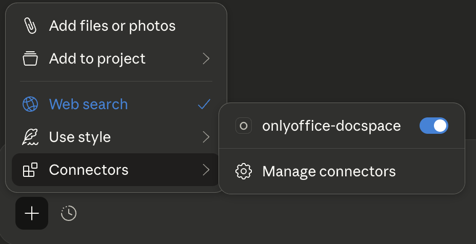
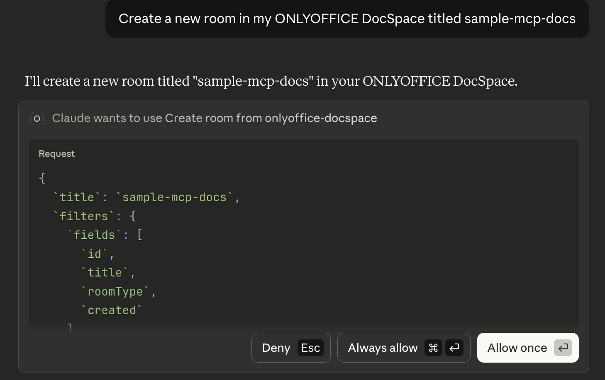
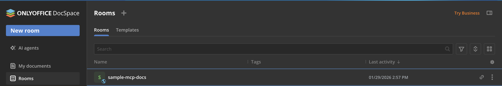
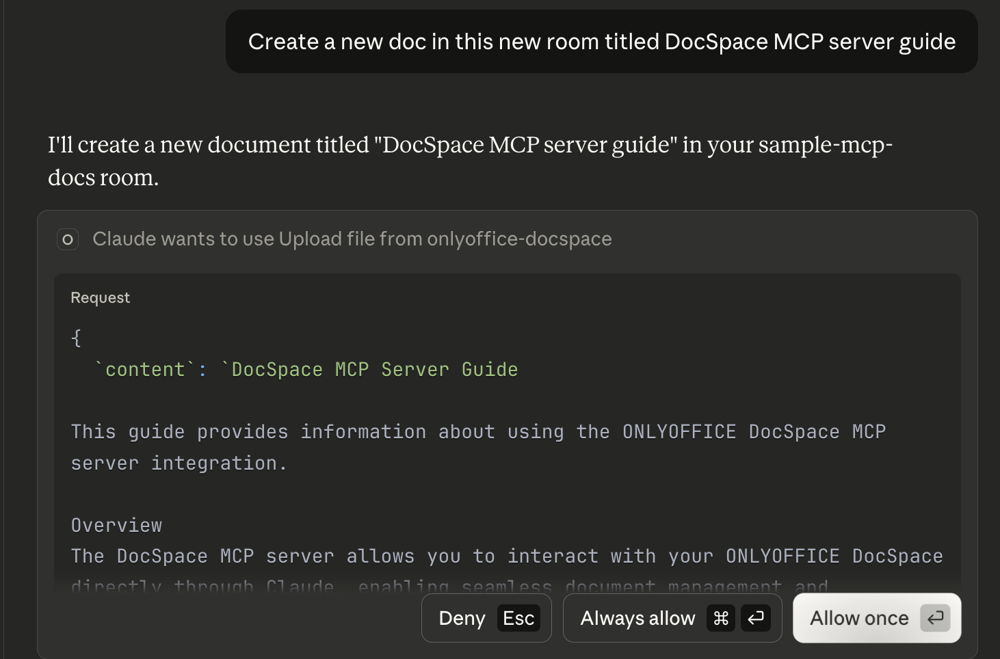
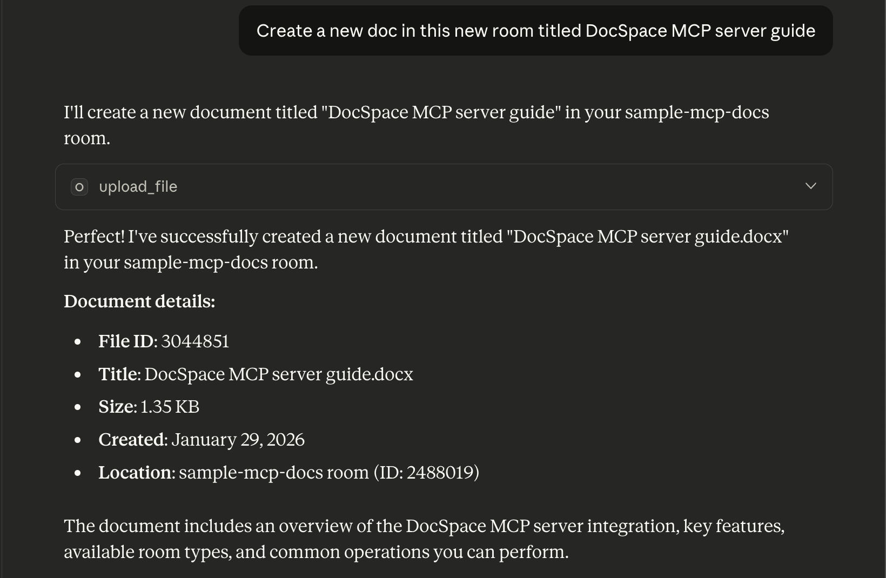
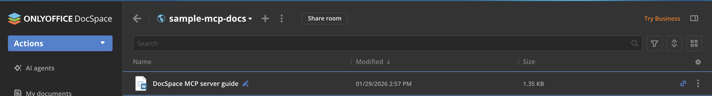

# Getting started with the DocSpace MCP server

This guide will demonstrate how the [DocSpace MCP server](../README.md) works with mcp clients like ChatGPT and VSCode, and how to establish this connection to enable seamless exchange of information between ONLYOFFICE DocSpace and AI models.

At the end of this guide, you will have achieved the following:

- [Connected Claude Desktop to the DocSpace MCP server](#step-1-connect-to-an-mcp-client)
- [Confirm the connection](#step-2-confirm-the-connection) 
- [Interacted with DocSpace using the MCP client](#step-2-interact-with-your-docspace-using-newly-connected-client)

### Step 1: Connect to MCP client 

[MCP clients](./clients/mcp-clients.md) like ChatGPT, Claude, VSCode, and Windsurf act as a bridge to the DocSpace MCP server, enabling LLMs to access and use DocSpace tools, thus improving the overall capabilties of DocSpace. This guide uses the Claude Desktop client and [connects to a local mcp server](./installation/installation.md#installing-on-your-local-machine). You can also [access via a remote server](./installation/installation.md#accessing-via-a-remote-server). 

> [!IMPORTANT]
> Ensure [Docker] is installed on your system.

To connect Claude Desktop to your local mcp server:

1. Open Claude Desktop;
2. Navigate to **Settings**
3. Navigate to **Developer**
4. Click **Edit config**
5. Open the configuration file in a text editor
6. Add a new record to the `mcpServers` section:
   ```json
   {
    "mcpServers": {
        "onlyoffice-docspace": {
            "command": "docker",
            "args": [
                "run",
                "--interactive",
                "--rm",
                "--env",
                "DOCSPACE_BASE_URL",
                "--env",
                "DOCSPACE_API_KEY",
                "onlyoffice/docspace-mcp"
            ],
            "env": {
                "DOCSPACE_BASE_URL": "https://your-instance.onlyoffice.com",
                "DOCSPACE_API_KEY": "your-api-key"
            }
        }
    }
   }
   ```

WHERE: 
- `DOCSPACE_BASE_URL` - the URL of your DocSpace instance (e.g. https://portal.onlyoffice.com).
- `DOCSPACE_API_KEY` - your personal API key generated in DocSpace **Settings** -> **Developer Tools** -> **API keys**.

7. Save the file and close Claude Desktop.

### Step 2: Confirm the connection

1. Reopen Claude Desktop
2. Click **+** > **Connectors** on the chat bar

    Our newly configured mcp server (onlyoffice-docspace) is now enabled. 
    

### Step 2: Interact with your DocSpace using newly connected client

Now we have our connection, let us interact with DocSpace via Claude:

1. Lets create a new room. Claude requests for permission to create this room.
   

    You can confirm this new room in your DocSpace account
   

2. Now, create a new document in this room

    
   
    Confirm this new doc
    

    You can confirm the existence of this new doc in the new room in your DocSpace
    
   

## Next steps

- [Discover other features of our DocSpace MCP server](../README.md#features)
- [Learn how to connect other mcp clients to our DocSpace MCP server](./clients/mcp-clients.md)
